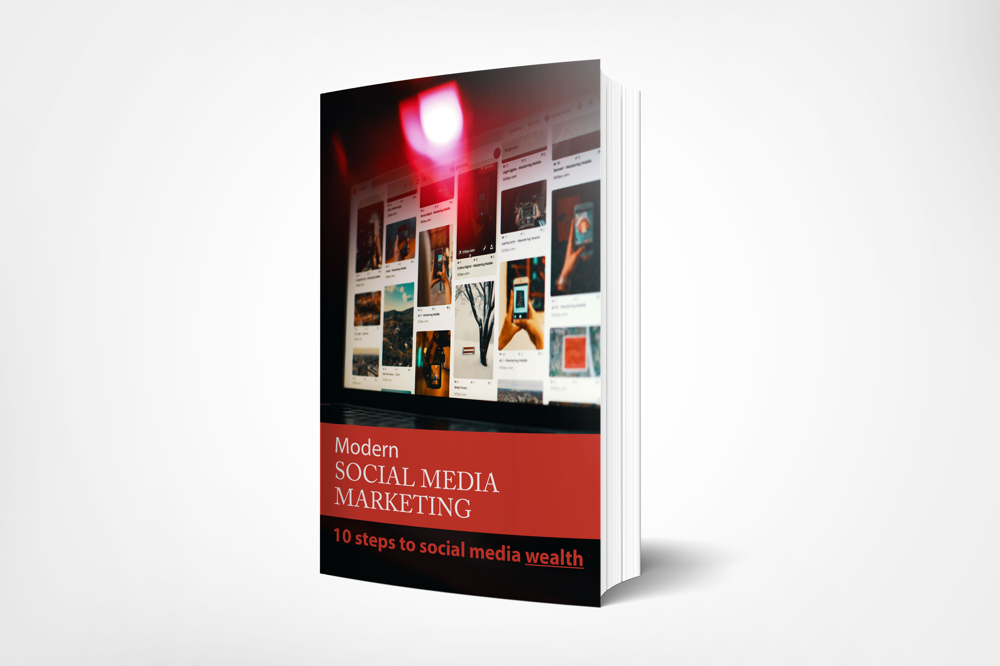

A lot of people have all sorts of wrong ideas about social media marketing. Some think that you only need to post "viral content" to get tons of traffic overnight.

They actually believe that if you are able to pump that much traffic to your target website, a large chunk of those people would buy whatever it is you are selling.

Maybe you're selling services, maybe you're selling an event, or maybe you are selling products from an online store, it doesn't matter. There is an assumption that social traffic, regardless of which platform it comes from and regardless of how you qualify that traffic, converts to sales readily.

Sadly, none of these assumptions are true. In fact, all of them are tragically mistaken.

Here’s where my advice for you comes in.

### With my insight...

- You are going to understand that whatever the case may be, the endgame is to get people to join your list.
- You will know how to call to action to the people through social media so they join your list.
- You will learn which platforms you should focus on in order to be successful.
- You will discover the wrong ideas marketers have about social media marketing.
- You are going to learn the secret to effective modern social media marketing.

To make it easy, I’ve put together a step-by-step guide that will show you exactly how it’s done.

### Introducing...

Modern Social Media Marketing

A Step-by-Step Guide to Unleash the Power of Modern Social Media Marketing in 10 Steps! No stones are left unturned when you get your hands on this now. You will become a complete expert on this, and you’ll get everything you need inside to do the same

### Here’s Just A Quick Preview Of What You’ll Discover Inside...

- What Social Media Marketing is and What it Isn't
- 8 Reasons Why You Need to Do Social Media Marketing
- You Need to Modify Your Social Media Marketing Campaign Based on Your Online Business Type
- The Classic Way to Do Social Media Marketing and Why it is a Waste of Your Time
- 10 Steps to Faster and Easier Modern Social Media Marketing
- How to Do Niche Research and Targeting the Right Way
- Content Curation: Your secret Social Media Marketing Weapon
- Reverse Engineer Your Competitors' Top Content
- Fine Tune Your Payload Content
- Market Your List Right
- Unlock the Power of Repurposed Content
- Use Automatic Content Sharing
- Scale Up Your Targeting
- Sell to Your List Differently
- Reinvest Your Profits the Right Way

Plus, a whole lot more... This is the easiest way to actually Unleash the Power of Modern Social Media Marketing in 10 Steps!

### Who Needs This Step-By-Step Guide?

If you answer YES to any of the below, you need this…

- You want to have a big email list with active subscribers.
- You have wrong ideas about social media marketing.
- You spend a lot of time, effort and money only to end up with a whole lot of nothing.
- You want to learn how to attract the attention of social media users effectively
- You want to know the secret to effective modern social media marketing.

### Does This Sound Like Exactly What You Need? But maybe your question is: How Much?

If you were going to hire an expert on this, to show you how it’s done, you could easily find yourself investing tens of thousands of naira for this sort of coaching. In fact, many people invest hundreds and thousands of naira to get into coaching programs or attend workshops...
But, you won’t have to invest anywhere near that today. Today, you can get INSTANT ACCESS for just &#x20A6;15,000. And it just keeps getting better…

### When You Make The Wise Decision To Grab This Today, You’ll Also Get These Fast Action Bonuses…

**Fast Action Bonus #1** – Modern Social Media Marketing - Cheat Sheet (Valued at &#x20A6;16k) This cheat sheet is a handy checklist that makes it easy to get started. It breaks up the entire guide into easy-to-follow steps so that you can make sure you have all the highlights of everything covered inside right at your fingertips. This makes it easy to track your progress and stay focused every step of the way.

**Fast Action Bonus #2** – Modern Social Media Marketing - Mind Map (Valued at &#x20A6;10k)

Some people learn better by looking at a mind map. This mind map gives you an overview of everything covered inside the guide. You can also print it out for quick reference anytime you need it!

**Fast Action Bonus #3** – Modern Social Media Marketing - Resource Guide (Valued at &#x20A6;10k)

The Resource Guide gives you a quick point of reference to all of the resources mentioned throughout the guide.

This makes it easy to plug-in and stick with what you are looking for.

### Try This Guide On MY DIME… There’s No Risk!

There are a lot of people that claim to offer a solution on how to do Modern Social Media Marketing, so it’s understandable if you’re a little skeptical. I can keep telling you just how great my guide is, but you really need to go through it and see for yourself what it’s all about to know if it’s for you… That’s why I’m going to give you a FULL 30 days to decide if this is for you… If for any reason, or no reason at all, you’re not 100% satisfied with what’s inside, simply send me an email, and I’ll refund every penny of your tiny investment… No questions asked!

## Click The Button Below Now To Get INSTANT ACCESS…

<a href='#' style='display: inline-block;
  margin: 0 0 0 0px;
  padding: 0 20px;
  height: 41px;
  outline: none;
  color: #fff;
  font-size: 2rem;
  line-height: 37px;
  font-weight: 400;
  text-align: center;
  text-shadow: 0 -1px 0 rgba(0, 0, 0, 0.1);
 background: blue;
  border-radius: 5px;
  box-shadow: 0 0 0 1px inset rgba(0, 0, 0, 0.14)'>Buy course</a>

Thank you so much for taking the time to take a look at this extremely limited offer that has the potential to help you Unleash the Power of Modern Social Media Marketing in 10 Steps!
I’ll see you on the inside!

YouWai

PS – I’ve compiled some of the most frequently asked questions about the guide that will show you how to plan for success!

## Frequently Asked Questions

**What’s this all about?**
This is a guide that will show you how to Unleash the Power of Modern Social Media Marketing in 10 Steps.

**Who is this for?**
If you answer YES to any of the below, you need this…

- You want to have a big email list with active subscribers.
- You have wrong ideas about social media marketing.
- You spend a lot of time, effort and money only to end up with a whole lot of nothing.
- You want to learn how to attract the attention of social media users effectively
- You want to know the secret to effective modern social media marketing.

**How long until I see results?**
You can begin seeing results extremely quickly… Within days and sometimes even within hours of getting started. The more you make this a part of your daily life, the better the results you’ll get.

**Do I need to buy anything other than this guide?** That’s the great thing about this… All you need to learn about Modern Social Media Marketing, is in this step-by-step guide.

**How is this guide delivered?**
You’ll get instant access to a PDF version of this guide along with download links for the rest of the bonuses. There’s no waiting… You can get started RIGHT NOW. How much? If you were going to hire an expert on this, to show you how it’s done, you could easily find yourself investing hundreds of dollars for this sort of coaching. But, you won’t have to invest anywhere near that today.

**Is there a guarantee?**
You bet. You get a full 30 days to make sure this is for you. If for any reason, or no reason at all, you’re not 100% satisfied, simply send me an email, and I’ll refund every penny of your tiny investment… No questions asked!

**How do I get INSTANT ACCESS?**
Click the button below now…
<a href='#' style='display: inline-block;
  margin: 0 0 0 0px;
  padding: 0 20px;
  height: 41px;
  outline: none;
  color: #fff;
  font-size: 2rem;
  line-height: 37px;
  font-weight: 400;
  text-align: center;
  text-shadow: 0 -1px 0 rgba(0, 0, 0, 0.1);
 background: blue;
  border-radius: 5px;
  box-shadow: 0 0 0 1px inset rgba(0, 0, 0, 0.14)'>Buy course</a>
